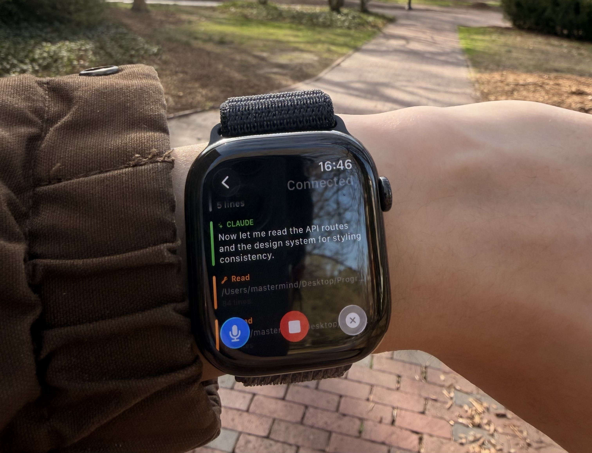

<p align="center">
  
</p>

<h1 align="center">WatchCode</h1>

<p align="center">
  Control Claude Code and OpenAI Codex from your Apple Watch.<br>
  Speak prompts, see live activity, interrupt tasks — so you can touch grass while shipping code.
</p>

<p align="center">
  Uses your existing subscriptions with zero additional API cost.
</p>

---

```
┌──────────────┐         ┌─────────────┐
│  Claude Code │──WS───> │  Anthropic   │ <──WS──┐
│  (terminal)  │ <──WS── │  (relay API) │ ──WS──>│
└──────────────┘         └─────────────┘         │    ┌──────────────┐         ┌─────────────┐
                                                 ├───>│ Relay Server │ <─HTTP─ │ Apple Watch │
┌──────────────┐         ┌─────────────┐         │    │  (Node.js)   │ ──SSE─> │  (SwiftUI)  │
│    Codex     │──WS───> │  Codex App  │ <──WS──┘    └──────────────┘         └─────────────┘
│  (terminal)  │ <──WS── │   Server    │ ──WS──>
└──────────────┘         └─────────────┘
```

> **Why a relay?** watchOS restricts WebSocket APIs to audio streaming apps only. The relay bridges backend WebSocket protocols to standard HTTP/SSE, which watchOS fully supports.

## How It Works

WatchCode bridges Claude Code's [Remote Control](https://docs.anthropic.com/en/docs/claude-code/remote-control) and OpenAI Codex's [App Server](https://developers.openai.com/codex/app-server) protocols to HTTP/SSE so watchOS can consume them. The relay server connects to one or both backends, transforms raw session events into a compact format, and streams them over SSE. Sessions from both providers appear in a unified list.

**The Watch app provides:**
- Voice dictation to send prompts
- Live event feed showing Claude's responses, tool calls, and results
- Interrupt button to stop Claude mid-task
- Configurable relay URL and shared secret auth

## Components

| Component | Path | Description |
|-----------|------|-------------|
| **Relay Server** | `server/` | Node.js/Express bridge from WebSocket to HTTP/SSE |
| **Web Client** | `client/` | React interface for relay management and testing |
| **Watch App** | `WatchCode/` | SwiftUI watchOS app (Xcode project) |

## Setup

### Prerequisites

- Node.js 20+
- An active [Claude](https://claude.ai) subscription with Claude Code and/or [OpenAI Codex](https://openai.com/index/introducing-codex/) CLI
- Xcode 26+ (for the Watch app)
- An Apple Watch running watchOS 26+

### 1. Relay Server

```bash
npm install
cp server/.env.example server/.env
```

Edit `server/.env`:

```env
# Get your OAuth token by running: claude oauth-token
ANTHROPIC_TOKEN=your_token_here

# Optional: your Anthropic org UUID (run: claude auth status)
ANTHROPIC_ORG_UUID=

# Codex app-server WebSocket URL (run: codex app-server --listen ws://127.0.0.1:4500)
# Can also be a remote authenticated proxy/tunnel URL that forwards to a local Codex instance
# Leave empty to disable Codex provider
CODEX_APP_SERVER_URL=ws://127.0.0.1:4500

# Shared secret for Watch app auth and Codex upstream WebSocket auth
# when connecting to Codex through an authenticated proxy/tunnel
WATCHCODE_SECRET=

# Server port
PORT=3847
```

> **Note:** At least one provider must be configured. You can enable just Claude Code, just Codex, or both.

```bash
# Development (with hot reload)
npm run dev:server

# Production
npm run build && npm start
```

### 2. Watch App

1. Open `WatchCode/WatchCode.xcodeproj` in Xcode
2. Select each target (`WatchCode` and `WatchCode Watch App`) and set your development team and bundle identifier under Signing & Capabilities
3. Build and run on your Apple Watch
4. In the Watch app's Settings, enter your relay server URL and shared secret

### 3. Web Client (optional)

A browser-based interface to the relay for testing and monitoring.

```bash
npm run dev:client
```

## Deployment

The relay server can be deployed to any Node.js host (Railway, Fly.io, Render, etc.).

| Variable | Required | Description |
|----------|----------|-------------|
| `ANTHROPIC_TOKEN` | For Claude | Your Anthropic OAuth token |
| `ANTHROPIC_ORG_UUID` | No | Anthropic organization UUID |
| `CODEX_APP_SERVER_URL` | For Codex | Codex app-server WebSocket URL or authenticated proxy/tunnel URL |
| `WATCHCODE_SECRET` | Recommended | Shared secret for relay API auth and Codex upstream WebSocket auth |
| `PORT` | No | Server port (default: 3847) |

When no `WATCHCODE_SECRET` is set, the relay runs in open mode (suitable for local development only).

## API

| Method | Endpoint | Description |
|--------|----------|-------------|
| `GET` | `/api/sessions` | List available Remote Control sessions |
| `POST` | `/api/connect` | Connect to a session |
| `GET` | `/api/sessions/:id/events` | SSE stream of session events |
| `POST` | `/api/sessions/:id/message` | Send a user message |
| `POST` | `/api/sessions/:id/control` | Send control commands (interrupt, etc.) |
| `DELETE` | `/api/connections/:id` | Disconnect from a session |
| `GET` | `/api/status` | Server health and active connections |

All endpoints require the `x-watchcode-secret` header when `WATCHCODE_SECRET` is configured.

## Security

- **No credential storage.** OAuth tokens are passed through and never written to disk by the relay.
- **Shared secret auth.** The `WATCHCODE_SECRET` prevents unauthorized access to your relay.
- **Codex upstream auth.** When `CODEX_APP_SERVER_URL` points to an authenticated proxy/tunnel, the relay also sends `x-watchcode-secret: <WATCHCODE_SECRET>` on the upstream Codex WebSocket connection.
- **TLS required in production.** Deploy behind HTTPS to protect tokens in transit.

## Architecture

See [ARCHITECTURE.md](ARCHITECTURE.md) for detailed system design, protocol reference, and data flow diagrams.

## License

[MIT](LICENSE) &copy; 2026 Eric Li
